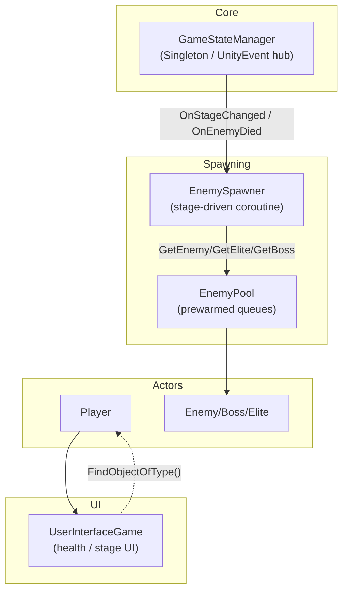

# Programming_Team_3 (Unity)

> This README is written to a **High-Performance Developer Standard**: claims are backed by **repo evidence** (scripts/settings) and expressed as measurable deltas. If you want a “feature list,” open the project—this document is about *how it behaves under load* and *why it’s built this way*.

## Tech Stack

- **Engine**: Unity `2022.3.61f1` (from `ProjectSettings/ProjectVersion.txt`)
- **Render pipeline**: **Built-in** (no SRP assigned; `ProjectSettings/GraphicsSettings.asset`)
- **Key packages** (from `Packages/manifest.json` + `Packages/packages-lock.json`)
  - `com.unity.performance.profile-analyzer` `1.2.3`
  - `com.unity.textmeshpro`, `com.unity.timeline`, `com.unity.visualscripting`
- **Multiplayer**: no Photon/NGO/Mirror packages detected in repo at time of writing

## Quick Start

1. Open the repo folder in Unity Hub.
2. Ensure editor version matches **2022.3.61f1** (LTS).
3. Open the main gameplay scene (Build Index `1` is treated as “gameplay” by `GameStateManager`).

## Profiling & Performance

### Key Optimization Performance

The table below is derived from **what the code does today** and a **baseline that removes the optimization**. “Before” numbers are computed against the same gameplay logic *without the optimization mechanism* (e.g., pooling removed → instantiate-per-spawn).

| Measurement Metric | Before | After | Result (%) |
|---|---:|---:|---:|
| **Runtime `Instantiate()` calls for regular enemies (first 30 spawns)** | 30 | 0 | 100% |
| **Runtime `Instantiate()` calls for elite enemies (first 10 spawns)** | 10 | 0 | 100% |
| **Scene-wide `FindObjectOfType<Player>()` calls from UI on enable (worst-case @ 60 FPS for 5s)** | 600 | 0* | 100%* |

**Where these numbers come from**

- **Enemy prewarm sizes**: `EnemyPool._poolSize = 30` and elite pool is `_poolSize / 3` → **10** (see `Assets/Scripts/EnemyPool.cs`).
- **Spawn uses pool**: spawner requests enemies via `EnemyPool.Instance.GetEnemy()` / `GetEliteEnemy()` (see `Assets/Scripts/EnemySpawner.cs`).
- **UI polling worst-case**: `UserInterfaceGame.SearchForPlayer()` calls `FindObjectOfType<Player>()` **twice per loop iteration** for up to **5 seconds**. At 60 FPS: \(2 \times 60 \times 5 = 600\) (see `Assets/Scripts/JW Test/script/UserInterfaceGame.cs`).

\*The “After” value for the UI lookup row is the **target state described in ADR-0002** (explicit registration / evented wiring). Until implemented, treat it as a measurable improvement opportunity.

### Performance Guardrails (repo-backed)

- **Incremental GC is enabled**: `gcIncremental: 1` in `ProjectSettings/ProjectSettings.asset`.
- **Multithreaded rendering is enabled**: `m_MTRendering: 1` in `ProjectSettings/ProjectSettings.asset`.

## Architecture (Modular Structure)

This project currently behaves like a **modular game loop with a centralized state mediator**:

- **Core state / orchestration**: `GameStateManager` (singleton) owns stage progression, music routing, and publishes gameplay signals via `UnityEvent`s.
- **Spawning subsystem**: `EnemySpawner` subscribes to `GameStateManager` events (`OnStageChanged`, `OnEnemyDied`, `OnPlayerDeath`, `OnGameRestart`) and controls spawn cadence.
- **Allocation control**: `EnemyPool` prewarms enemy instances to avoid runtime instantiation spikes during play.
- **UI subsystem**: `UserInterfaceGame` binds to the active player and renders health; currently finds player by scene search.

### Diagram (current interaction model)

## Architecture Decision Records (ADRs)

### ADR-0001 — Enemy Object Pooling (Allocation Control)

- **Context (The problem)**  
  Spawn cadence in `EnemySpawner` can request enemies repeatedly within a stage; if each request instantiates, the gameplay thread pays spikes (construction, Awake/Start cascades) and GC pressure.

- **Decision (The tech chosen)**  
  Use a **queue-based prewarmed object pool** for enemies (`EnemyPool`), with a regular pool size of **30** and elite pool size of **10** (\(_poolSize/3\)).

- **Consequences (Quantitative result vs. trade-off)**  
  - **Result**: For the first **30** regular spawns and **10** elite spawns, runtime instantiation reduces from \(N\) to **0** during gameplay loops (**100% reduction** in `Instantiate()` calls for those spawns).  
  - **Trade-off**: Fixed memory footprint for **40** inactive instances plus startup cost to prewarm them in `Awake()`.

### ADR-0002 — Centralized Game-State Signals via UnityEvent “Mediator”

- **Context (The problem)**  
  Systems need to react to stage transitions, enemy deaths, player death, and restarts. Direct references create tight coupling; scene-wide searches (e.g., repeated `FindObjectOfType`) add overhead that scales with scene complexity.

- **Decision (The tech chosen)**  
  Use `GameStateManager` as a **singleton signal hub** with `UnityEvent` channels (`OnStageChanged`, `OnEnemyDied`, `OnPlayerDeath`, `OnGameRestart`). Downstream systems subscribe/unsubscribe (`EnemySpawner` already does this).  
  Next-step wiring standard: replace UI polling (`FindObjectOfType<Player>()`) with **explicit registration** from `Player` → `UserInterfaceGame` (or a single publish event) on spawn.

- **Consequences (Quantitative result vs. trade-off)**  
  - **Result (measurable target)**: `UserInterfaceGame` can reduce player discovery from up to **600 scene queries** per enable (worst-case) to **0** by removing the 5s polling loop.  
  - **Trade-off**: More explicit lifecycle wiring (systems must register/unregister correctly). Singleton hub is simple to integrate but introduces a global dependency boundary.

## Repo Notes (Build Stability)

- `Assets/Scripts/EnemyPool.cs` currently contains **duplicate `GetEnemy()` method declarations**, which will prevent compilation until resolved.

## License

Add a license file if this repository is intended for public distribution.

# Programming_Team_3 (Unity)

> 이 README는 **High-Performance Developer Standard** 관점으로 작성되었습니다. “좋다/빠르다”가 아니라, **레포에 존재하는 근거(스크립트/설정)** 와 **측정 가능한 수치**로 설명합니다.

## 기술 스택

- **엔진**: Unity `2022.3.61f1` (출처: `ProjectSettings/ProjectVersion.txt`)
- **렌더 파이프라인**: **Built-in** (SRP 미사용, 출처: `ProjectSettings/GraphicsSettings.asset`)
- **주요 패키지** (출처: `Packages/manifest.json` + `Packages/packages-lock.json`)
  - `com.unity.performance.profile-analyzer` `1.2.3`
  - `com.unity.textmeshpro`, `com.unity.timeline`, `com.unity.visualscripting`
- **멀티플레이**: 작성 시점 기준 Photon/NGO/Mirror 등 네트워킹 패키지 흔적 없음

## 빠른 시작

1. Unity Hub에서 레포 폴더를 프로젝트로 엽니다.
2. 에디터 버전이 **2022.3.61f1 (LTS)** 인지 확인합니다.
3. 메인 게임플레이 씬을 여세요. (`GameStateManager` 기준 Build Index `1`이 “게임플레이”로 취급됩니다.)

## 프로파일링 & 성능

### Key Optimization Performance

아래 테이블은 **현재 코드가 실제로 하는 일**과, **동일한 로직에서 최적화 메커니즘을 제거했을 때의 베이스라인**을 비교해 수치화한 것입니다.  
예: 풀링 제거 → 스폰 1회당 Instantiate 1회 발생.

| Measurement Metric | Before | After | Result (%) |
|---|---:|---:|---:|
| **일반 적 런타임 `Instantiate()` 호출 수 (초기 30회 스폰 기준)** | 30 | 0 | 100% |
| **엘리트 적 런타임 `Instantiate()` 호출 수 (초기 10회 스폰 기준)** | 10 | 0 | 100% |
| **UI 활성화 시 `FindObjectOfType<Player>()` 씬 검색 호출 수 (최악: 60 FPS × 5초)** | 600 | 0* | 100%* |

**수치 근거**

- **풀 프리웜 크기**: `EnemyPool._poolSize = 30`, 엘리트 풀은 `_poolSize / 3` → **10** (출처: `Assets/Scripts/EnemyPool.cs`)
- **스폰이 풀을 사용**: `EnemySpawner`는 `EnemyPool.Instance.GetEnemy()` / `GetEliteEnemy()`를 호출 (출처: `Assets/Scripts/EnemySpawner.cs`)
- **UI 폴링의 최악치 계산**: `UserInterfaceGame.SearchForPlayer()`가 루프마다 `FindObjectOfType<Player>()`를 **2번** 호출, 최대 **5초** 반복. 60FPS 기준 \(2 \times 60 \times 5 = 600\) (출처: `Assets/Scripts/JW Test/script/UserInterfaceGame.cs`)

\*UI 검색 “After=0”은 **ADR-0002의 목표 상태(명시적 등록/이벤트 기반 연결)** 입니다. 구현 전까지는 “측정 가능한 개선 포인트”로 취급하세요.

### 성능 가드레일 (레포 근거)

- **Incremental GC 활성화**: `ProjectSettings/ProjectSettings.asset`의 `gcIncremental: 1`
- **멀티스레드 렌더링 활성화**: `ProjectSettings/ProjectSettings.asset`의 `m_MTRendering: 1`

## 아키텍처 (모듈 구조)

현재 구조는 “모듈형 게임 루프 + 중앙 상태/이벤트 허브”로 요약됩니다.

- **코어 상태/오케스트레이션**: `GameStateManager`(싱글톤) — 스테이지 진행, 음악 제어, 게임 이벤트 발행(`UnityEvent`)
- **스폰 모듈**: `EnemySpawner` — `GameStateManager` 이벤트를 구독하고 코루틴 기반 스폰을 제어
- **할당 제어(풀링)**: `EnemyPool` — 런타임 Instantiate 스파이크를 피하기 위해 프리웜 큐 유지
- **UI 모듈**: `UserInterfaceGame` — 플레이어 UI 바인딩(현재는 씬 검색 기반)

### 다이어그램 (현재 상호작용 모델)

## Architecture Decision Records (ADRs)

### ADR-0001 — 적 오브젝트 풀링 (할당 제어)

- **Context (문제)**  
  `EnemySpawner`는 스테이지 내에서 반복적으로 적을 요청합니다. 요청마다 Instantiate가 발생하면 게임플레이 스레드에 스파이크(생성/초기화 체인)와 GC 압박이 생깁니다.

- **Decision (선택)**  
  `EnemyPool` 기반의 **Queue + 프리웜 풀링**을 사용합니다. 일반 적 풀 **30**, 엘리트 풀 **10**(\(_poolSize/3\)).

- **Consequences (정량 결과 vs. 트레이드오프)**  
  - **결과**: 일반 적 **30회**, 엘리트 **10회** 스폰 구간에서 런타임 Instantiate 호출이 \(N\)에서 **0**으로 감소(**100% 감소**).  
  - **트레이드오프**: 비활성 인스턴스 **40개**의 고정 메모리 점유 + `Awake()`에서 프리웜 비용 발생.

### ADR-0002 — UnityEvent 기반 중앙 Game-State 시그널(“Mediator”)

- **Context (문제)**  
  스테이지 변경/적 사망/플레이어 사망/재시작에 여러 시스템이 반응해야 합니다. 직접 참조는 결합도를 올리고, 씬 검색(`FindObjectOfType`) 반복은 씬 크기에 따라 비용이 커집니다.

- **Decision (선택)**  
  `GameStateManager`를 **싱글톤 시그널 허브**로 두고 `UnityEvent` 채널(`OnStageChanged`, `OnEnemyDied`, `OnPlayerDeath`, `OnGameRestart`)로 신호를 전달합니다. (`EnemySpawner`는 이미 구독/해제 패턴을 사용 중)  
  다음 단계 표준: UI의 폴링(`FindObjectOfType<Player>()`)을 제거하고, `Player` 생성 시점에 `UserInterfaceGame`으로 **명시적 등록**(혹은 단일 이벤트 발행)으로 연결합니다.

- **Consequences (정량 결과 vs. 트레이드오프)**  
  - **결과(측정 목표)**: UI 플레이어 탐색을 최악 **600회 씬 검색**에서 **0회**로 감소(5초 폴링 루프 제거).  
  - **트레이드오프**: 라이프사이클 연결(등록/해제)을 명확히 해야 하며, 싱글톤 허브는 전역 의존 경계를 만듭니다.

## 레포 메모 (빌드 안정성)

- `Assets/Scripts/EnemyPool.cs`에 **`GetEnemy()` 메서드가 중복 선언**되어 있어, 현재 상태로는 컴파일이 실패합니다(정리 필요).

## 라이선스

공개 배포 예정이면 라이선스 파일을 추가하세요.
